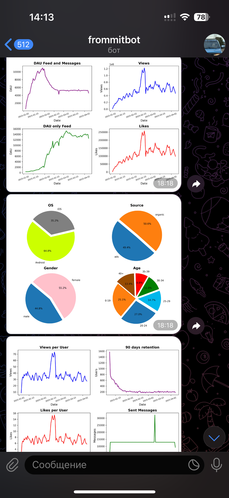

#  Telegram-бот отчётов по соцсети (Airflow + ClickHouse)

Автоматизированный аналитический скрипт, который ежедневно собирает ключевые метрики активности пользователей соцсети, строит графики и отправляет отчёт в Telegram.

Проект реализован в виде DAG для Apache Airflow и подключается к ClickHouse через библиотеку `pandahouse`.

---

##  Что делает скрипт

Скрипт `report_all_app.py` выполняет следующие шаги:

1. **Собирает данные из ClickHouse:**
   - DAU по ленте, сообщениям и общая активность
   - Кол-во просмотров, лайков, сообщений
   - Распределение пользователей по:
     - операционным системам
     - полу
     - возрасту
     - источнику трафика
   - Retention по пользователям с регистрацией 90+ дней назад
   - Лайки и просмотры в пересчёте на одного пользователя

2. **Формирует визуализации:**
   - 📈 Графики DAU, просмотров, лайков
   - 📊 Барчарты по OS, полу, возрасту и источнику
   - 📉 Retention и поведение активных пользователей

3. **Отправляет в Telegram:**
   - 3 PNG-графика
   - в указанный Telegram-чат с помощью Telegram Bot API

---

## 🛠 Используемые технологии

- **Python 3**
- **Apache Airflow** — планирование DAG
- **ClickHouse** — источник аналитических данных
- **pandas / matplotlib / seaborn** — аналитика и визуализация
- **pandahouse** — подключение к ClickHouse
- **python-telegram-bot** — отправка отчётов в Telegram

---

## 📅 Расписание

Скрипт запускается автоматически каждый день в 08:00 по UTC (`0 8 * * *`), собирает данные за вчерашний день и формирует графики за последнюю неделю.

---
## 📸 Пример работы бота

### Telegram-уведомление:

- [График 1 (IMG_2503.JPG)](screenshots/IMG_2503.JPG)
- [График 2 (IMG_2504.JPG)](screenshots/IMG_2504.JPG)
- [График 3 (IMG_2505.JPG)](screenshots/IMG_2505.JPG)
